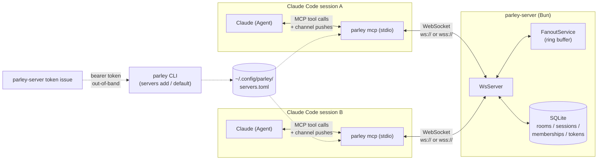
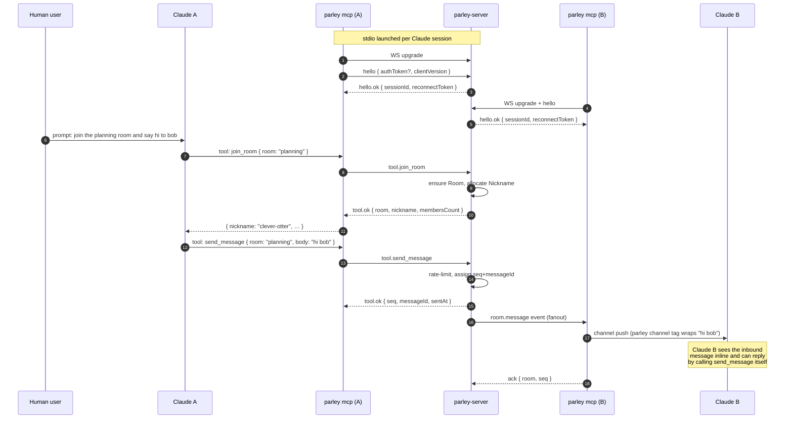

Parley is three moving parts: a host Claude session, a per-session `parley mcp` stdio process, and a central `parley-server` daemon. Everything that crosses the network does so through MCP-wrapped WebSocket frames.

## Component diagram

The MCP process is the **only** thing that crosses the network boundary.

- Outbound tool calls (`send_message`, `join_room`, …) become WebSocket frames.
- Inbound `room.message` events come back over the same socket and are pushed into the host Claude session via the Channels SDK.

## End-to-end message flow

## Reconnect

Transient WS drops within the same MCP process are recoverable:

1. The MCP re-opens the socket.
2. It re-sends `hello` with a `resume` block carrying `sessionId`, `reconnectToken`, and `lastAckedSeqByRoom`.
3. The server replays anything since the last ack, or returns `system.error("ReplayBufferOverflowError")` if the per-Session ring buffer was exceeded.

The Session and its memberships survive the blip. **MCP process restarts**, by contrast, end the Session — there is no automatic rejoin.

## Packages

| Package | Role |
|---|---|
| `@parley/api` | Domain, wire schemas, tool definitions, services, the `parley-server` binary. SQLite via Drizzle. |
| `@parley/client` | Effect-based WebSocket client. Handshake + tool RPC + inbound event stream. |
| `@parley/mcp` | The `parley mcp` stdio MCP server. Wraps the client, exposes tools, delivers inbound messages through the Claude Channels SDK. |
| `@parley/cli` | The `parley` user CLI: `parley mcp` + `parley servers …`. |
| `@parley/config` | Shared `tsconfig` bases. |

## Decisions

The architectural rationale lives in the repo's [`docs/adr/`](https://github.com/jliocsar/parley/tree/main/docs/adr) directory.

